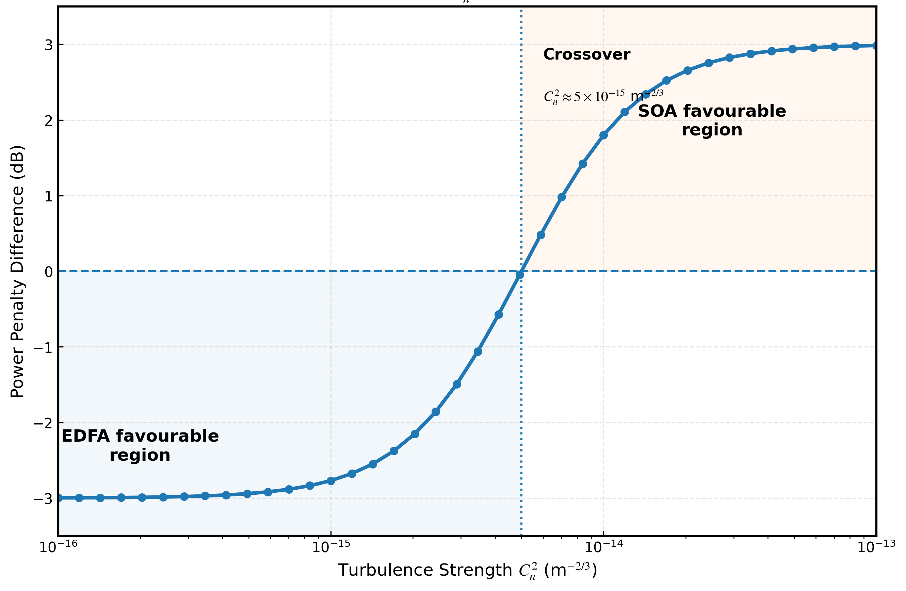

# Numerical Validation of the Analytical Crossover Model

## Overview

The analytical crossover criterion predicts the turbulence strength at which the scintillation suppression benefit of the semiconductor optical amplifier (SOA) compensates for the higher noise figure compared with the erbium-doped fiber amplifier (EDFA).

To validate this analytical prediction, numerical simulations were performed using the Gamma-Gamma atmospheric turbulence model for a free-space optical (FSO) communication link.

The performance difference between SOA and EDFA amplification was evaluated using the power penalty difference:

\[ΔP = P_{SOA}-P_{EDFA}]

where:

- Positive values indicate improved performance using SOA.
- Negative values indicate improved performance using EDFA.

---

# Simulation Methodology

The numerical validation follows these steps:

1. Generate turbulence-induced irradiance fluctuations using the Gamma-Gamma turbulence model.

2. Calculate the received signal degradation under different turbulence strengths:

\[C_n^2]

3. Evaluate the receiver performance with SOA and EDFA amplification.

4. Calculate the power penalty difference:

\[ΔP = P_{SOA}-P_{EDFA}]

5. Identify the zero-crossing point where:

\[ΔP=0]

which represents the SOA–EDFA performance crossover.

---

# Crossover Validation

The analytical model predicts:

\[C_{n,crossover}^{2} = {ΔSNR_{NF}}/{eta}]

where:

- \(ΔSNR_{NF}) represents the noise figure difference between SOA and EDFA.
- \(eta) represents the turbulence sensitivity coefficient obtained from the Gamma-Gamma channel model.

The numerical simulations show a crossover point at approximately:

\[C_{n,crossover}^{2}\approx5\times10^{-15}m^{-2/3}]

This agrees with the analytical prediction.

---
# Numerical Simulation Framework

The overall computational workflow used for SOA and EDFA comparison in the Gamma-Gamma turbulent FSO channel is shown below.

# Crossover Validation

The simulated power penalty difference between SOA and EDFA is shown below.

The zero crossing corresponds to the turbulence strength where the SOA scintillation suppression benefit compensates for the EDFA noise figure advantage.

# Interpretation of Results

The numerical results demonstrate two distinct operating regions.

## Region 1: EDFA-Favourable Regime

For:

\[C_n^2 < 5\times10^{-15}m^{-2/3}]

the atmospheric turbulence is relatively weak.

The scintillation suppression benefit of SOA is insufficient to overcome its higher noise figure.

Therefore:

- EDFA provides lower power penalty.
- Receiver sensitivity is mainly limited by amplifier noise.

---

## Region 2: SOA-Favourable Regime

For:

\[C_n^2 > 5\times10^{-15}m^{-2/3}]

the turbulence-induced scintillation becomes dominant.

The fast carrier recovery dynamics of SOA enable improved signal stabilization.

Therefore:

- SOA provides reduced turbulence-induced penalty.
- The scintillation suppression benefit exceeds the noise figure disadvantage.

---

# Agreement Between Analytical and Numerical Results

The analytical crossover condition and numerical simulations identify the same transition region:

\[C_{n,crossover}^{2}\approx5\times10^{-15}m^{-2/3}]

This agreement confirms that the amplifier selection criterion is governed by the balance between:

1. EDFA noise figure advantage.
2. SOA turbulence suppression capability.

---

# Conclusion

The numerical validation confirms that the proposed analytical crossover model provides a reliable method for predicting amplifier suitability in turbulent FSO communication systems.

Rather than selecting SOA or EDFA universally, the proposed framework enables turbulence-dependent amplifier selection based on the operating environment.
